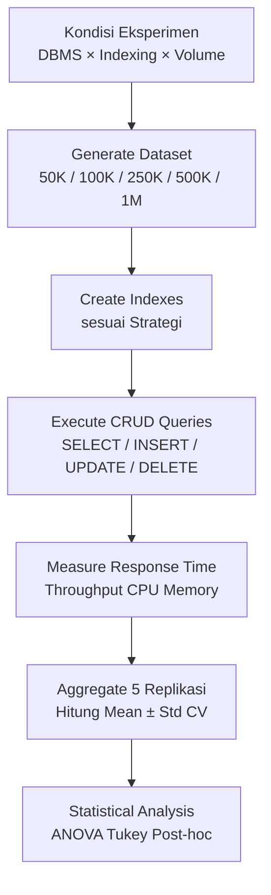

# Skema Database & Strategi Indexing

Dokumen ini menjelaskan desain skema database `app_playstore` dan strategi indexing yang diuji dalam benchmark eksperimen.

## 1. Skema Database: app_playstore

Tabel `app_playstore` terinspirasi dari dataset Google Playstore, dengan 19 kolom mencakup metadata aplikasi:

```sql
CREATE TABLE app_playstore (
    id              INT/SERIAL PRIMARY KEY,
    app_name        VARCHAR(255) NOT NULL,
    app_id          VARCHAR(100) NOT NULL,
    category        VARCHAR(100) NOT NULL,
    rating          FLOAT DEFAULT 0.0,
    rating_count    INT DEFAULT 0,
    installs        VARCHAR(50),
    free            BOOLEAN/TINYINT(1) DEFAULT TRUE,
    price           FLOAT DEFAULT 0.0,
    currency        VARCHAR(10) DEFAULT 'USD',
    size            VARCHAR(20),
    min_android     VARCHAR(50),
    developer_id    VARCHAR(100),
    released        DATE,
    last_updated    DATE,
    content_rating  VARCHAR(50),
    ad_supported    BOOLEAN/TINYINT(1) DEFAULT FALSE,
    in_app_purchases BOOLEAN/TINYINT(1) DEFAULT FALSE,
    editors_choice  BOOLEAN/TINYINT(1) DEFAULT FALSE,
    scraped_time    TIMESTAMP DEFAULT NOW()
);
```

**Perbedaan PostgreSQL vs MySQL:**
- PostgreSQL: `SERIAL PRIMARY KEY` vs MySQL: `INT AUTO_INCREMENT PRIMARY KEY`
- PostgreSQL: `BOOLEAN` vs MySQL: `TINYINT(1)`
- PostgreSQL: `TIMESTAMP` vs MySQL: `DATETIME`

## 2. Strategi Indexing yang Diuji

Eksperimen menguji **tiga strategi indexing** sebagai kondisi eksperimen:

### Strategi 1: NO INDEX (Baseline)

Hanya primary key (PK) yang ada, tidak ada secondary index. Semua query CRUD berjalan dengan full table scan (FTS).

```sql
-- Hanya PK, tidak ada index tambahan
```

**Karakteristik:**
- INSERT/UPDATE/DELETE: cepat (tidak perlu maintain index)
- SELECT: lambat (full table scan pada volume besar)
- Space efficient

### Strategi 2: SINGLE COLUMN INDEX

Index pada satu kolom yang sering diquery (`category` sebagai contoh umum pada filtering).

```sql
CREATE INDEX idx_app_playstore_category ON app_playstore(category);
```

**Karakteristik:**
- INSERT/UPDATE/DELETE: sedikit lebih lambat (maintain 1 index)
- SELECT dengan filter `WHERE category = ?`: lebih cepat (B-tree lookup)
- Moderate space overhead

### Strategi 3: COMPOSITE INDEX

Index pada multiple kolom untuk query dengan multiple filter atau complex WHERE clause.

```sql
CREATE INDEX idx_app_playstore_category_rating ON app_playstore(category, rating DESC);
```

**Karakteristik:**
- INSERT/UPDATE/DELETE: paling lambat (maintain composite index)
- SELECT dengan filter `WHERE category = ? AND rating > ?`: paling cepat (covering index)
- Highest space overhead

## 3. Operasi CRUD dalam Benchmark

Setiap operasi CRUD dijalankan dengan pola query realistis:

### SELECT (Read)

```sql
SELECT * FROM app_playstore WHERE category = ?;
SELECT * FROM app_playstore WHERE rating > ? ORDER BY rating DESC LIMIT 100;
```

**Expected Impact Indexing:**
- No-index: Full table scan, latency meningkat linear dengan volume
- Single-index: B-tree lookup on `category`, latency berkurang signifikan
- Composite-index: Covering index, latency paling rendah

### INSERT (Create)

```sql
INSERT INTO app_playstore (app_name, app_id, category, rating, ...) 
VALUES (?, ?, ?, ?, ...);
```

**Expected Impact Indexing:**
- No-index: Fastest (only update PK)
- Single-index: Slower (update PK + 1 index)
- Composite-index: Slowest (update PK + composite index)

### UPDATE (Update)

```sql
UPDATE app_playstore SET rating = ?, rating_count = ? 
WHERE app_id = ?;
```

**Expected Impact Indexing:**
- Similar to INSERT; composite index adds maintenance cost

### DELETE (Delete)

```sql
DELETE FROM app_playstore WHERE app_id = ?;
```

**Expected Impact Indexing:**
- No-index: Sequential scan to find record
- Single/Composite-index: Index lookup, then delete
- Trade-off less severe than INSERT

## 4. Diagram Alur Eksperimen



## 5. Faktor Kontrol (Control Variable)

- **Hardware:** Spesifikasi tetap (CPU, RAM, storage type)
- **DBMS Version:** PostgreSQL 16.3, MySQL 8.0.32
- **Query Pattern:** Standardized, tidak ada ad-hoc optimization
- **Data Distribution:** Uniform random, representatif Playstore real-world
- **Warm-up:** Cache warm sebelum measurement untuk fair comparison

## 6. Hipotesis Performa

| Perbandingan | Hipotesis | Rationale |
|-------------|-----------|-----------|
| SELECT: No-index vs Composite-index | Composite ~72% lebih cepat | Index eliminates full scan |
| INSERT: No-index vs Composite-index | Composite ~28% lebih lambat | Index maintenance overhead |
| PostgreSQL vs MySQL (no-index) | PostgreSQL ~27% lebih cepat | Better query planner |
| PostgreSQL vs MySQL (composite-index) | PostgreSQL ~19% lebih cepat | Efficient index structure |
   