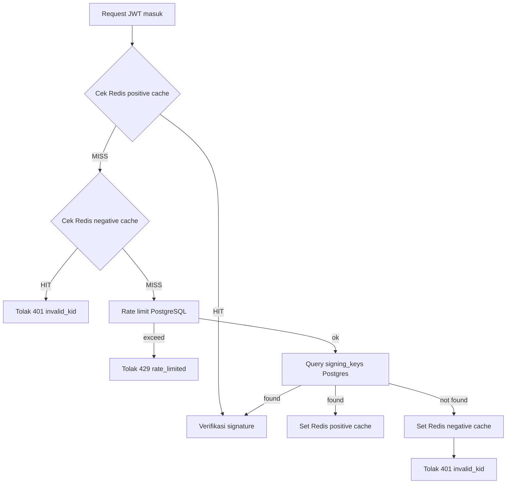

# Arsitektur & Skema Database

Dokumen ini menjelaskan desain arsitektur API Gateway untuk mitigasi JWKS Endpoint Flooding dan skema database yang digunakan.

## 1. Arsitektur Umum

Gateway menerima permintaan dengan header JWT. Alur resolusi `kid`:

1. Cek Redis positive cache `jwks:kid:<kid>`.
2. Jika miss, cek Redis negative cache `jwks:negative:<kid>`.
3. Jika miss lagi, lakukan `rate_limit` di PostgreSQL.
4. Jika tidak melebihi ambang, query `signing_keys` di PostgreSQL.
5. Jika ditemukan, simpan JWK ke negative cache atau positive cache sesuai hasil.

## 2. Diagram Mermaid



## 3. Komponen Sistem

- **API Gateway (Go + Echo)**
- **Redis**
  - Positive cache: `jwks:kid:<kid>`
  - Negative cache: `jwks:negative:<kid>`
- **PostgreSQL**
  - `signing_keys` sebagai source of truth
  - `rate_limit_counters` sebagai counter permanen

## 4. Skema PostgreSQL

```sql
CREATE TABLE signing_keys (
    kid VARCHAR(255) PRIMARY KEY,
    kty VARCHAR(10) NOT NULL DEFAULT 'RSA',
    alg VARCHAR(10) NOT NULL DEFAULT 'RS256',
    use_type VARCHAR(10) NOT NULL DEFAULT 'sig',
    n TEXT NOT NULL,
    e TEXT NOT NULL,
    is_active BOOLEAN NOT NULL DEFAULT TRUE,
    created_at TIMESTAMPTZ NOT NULL DEFAULT now(),
    expires_at TIMESTAMPTZ,
    revoked_at TIMESTAMPTZ
);

CREATE INDEX idx_signing_keys_active ON signing_keys (kid) WHERE is_active = TRUE;

CREATE TABLE rate_limit_counters (
    client_ip INET NOT NULL,
    window_start TIMESTAMPTZ NOT NULL,
    request_count INTEGER NOT NULL DEFAULT 0,
    blocked_count INTEGER NOT NULL DEFAULT 0,
    PRIMARY KEY (client_ip, window_start)
);
```

### Upsert counter atomik

```sql
INSERT INTO rate_limit_counters (client_ip, window_start, request_count)
VALUES ($1, $2, 1)
ON CONFLICT (client_ip, window_start)
DO UPDATE SET request_count = rate_limit_counters.request_count + 1
RETURNING request_count;
```

## 5. Kunci Redis

- `jwks:kid:<kid>` — JWK valid, TTL ~300 detik.
- `jwks:negative:<kid>` — marker invalid, TTL ~60 detik.

## 6. Pertimbangan Desain

- **Fail-closed**: jika PostgreSQL tidak tersedia, request ditolak.
- **Fail-open**: jika Redis down, gateway tetap dapat memverifikasi via PostgreSQL.
- **Mode eksperimen**: `CACHE_MODE=none` untuk baseline tanpa cache/rate-limit dan `CACHE_MODE=hybrid` untuk mitigasi penuh.

## 7. Hubungan ke Implementasi

Desain ini menjadi dasar implementasi Tahap 2 dan pengujian Tahap 3. Semua parameter utama dikendalikan oleh environment variable dan konfigurasi deploy.
