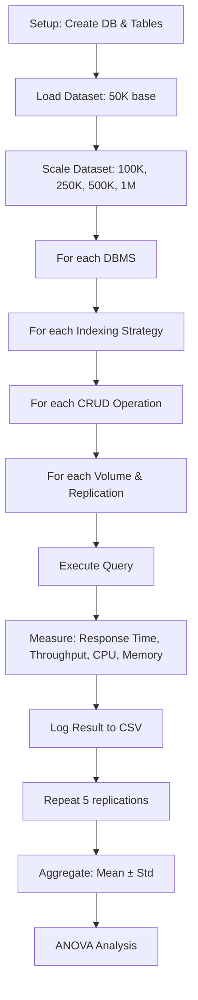

# Tahap 1 — Perancangan Arsitektur & Skema Database

**Status:** Selesai

---

## 1. Komponen Sistem Benchmark

1. **PostgreSQL 16.3** — DBMS pertama untuk perbandingan
   - Host: `localhost:5433` (dari host), `postgres:5432` (dari container)
   - Database: `benchmark`
   - Tabel: `app_playstore` (19 kolom)

2. **MySQL 8.0.32** — DBMS kedua untuk perbandingan
   - Host: `localhost:3307` (dari host), `mysql:3306` (dari container)
   - Database: `benchmark`
   - Tabel: `app_playstore` (19 kolom)

3. **Monitoring & Logging**
   - CSV logs untuk setiap trial: response_time, throughput, CPU%, memory, timestamp
   - Resource collection: Docker `docker stats` polling setiap 1 detik

---

## 2. Skema Database: app_playstore

Tabel standardized di kedua DBMS, terinspirasi dari dataset Google Playstore:

### PostgreSQL Schema

```sql
CREATE TABLE app_playstore (
    id              SERIAL PRIMARY KEY,
    app_name        VARCHAR(255) NOT NULL,
    app_id          VARCHAR(100) NOT NULL,
    category        VARCHAR(100) NOT NULL,
    rating          FLOAT DEFAULT 0.0,
    rating_count    INT DEFAULT 0,
    installs        VARCHAR(50),
    free            BOOLEAN DEFAULT TRUE,
    price           FLOAT DEFAULT 0.0,
    currency        VARCHAR(10) DEFAULT 'USD',
    size            VARCHAR(20),
    min_android     VARCHAR(50),
    developer_id    VARCHAR(100),
    released        DATE,
    last_updated    DATE,
    content_rating  VARCHAR(50),
    ad_supported    BOOLEAN DEFAULT FALSE,
    in_app_purchases BOOLEAN DEFAULT FALSE,
    editors_choice  BOOLEAN DEFAULT FALSE,
    scraped_time    TIMESTAMP DEFAULT NOW()
);
```

### MySQL Schema

```sql
CREATE TABLE app_playstore (
    id              INT AUTO_INCREMENT PRIMARY KEY,
    app_name        VARCHAR(255) NOT NULL,
    app_id          VARCHAR(100) NOT NULL,
    category        VARCHAR(100) NOT NULL,
    rating          FLOAT DEFAULT 0.0,
    rating_count    INT DEFAULT 0,
    installs        VARCHAR(50),
    free            TINYINT(1) DEFAULT 1,
    price           FLOAT DEFAULT 0.0,
    currency        VARCHAR(10) DEFAULT 'USD',
    size            VARCHAR(20),
    min_android     VARCHAR(50),
    developer_id    VARCHAR(100),
    released        DATE,
    last_updated    DATE,
    content_rating  VARCHAR(50),
    ad_supported    TINYINT(1) DEFAULT 0,
    in_app_purchases TINYINT(1) DEFAULT 0,
    editors_choice  TINYINT(1) DEFAULT 0,
    scraped_time    DATETIME DEFAULT CURRENT_TIMESTAMP
) ENGINE=InnoDB DEFAULT CHARSET=utf8mb4;
```

---

## 3. Strategi Indexing yang Diuji

Tiga kondisi indexing diciptakan secara dinamis sebelum eksperimen:

### Kondisi 1: NO INDEX (Baseline)

Hanya primary key, tanpa index tambahan. Semua query CRUD menggunakan full table scan.

```sql
-- Tidak ada index tambahan
```

### Kondisi 2: SINGLE COLUMN INDEX

Index pada kolom `category` yang sering di-query dalam WHERE clause.

```sql
-- PostgreSQL
CREATE INDEX idx_app_playstore_category ON app_playstore(category);

-- MySQL
CREATE INDEX idx_app_playstore_category ON app_playstore(category);
```

### Kondisi 3: COMPOSITE INDEX

Index pada multiple kolom untuk optimasi query dengan multiple filter.

```sql
-- PostgreSQL
CREATE INDEX idx_app_playstore_category_rating ON app_playstore(category, rating DESC);

-- MySQL
CREATE INDEX idx_app_playstore_category_rating ON app_playstore(category, rating DESC);
```

---

## 4. Alur Eksperimen



---

## 5. Control Variables

| Variable | Setting | Rationale |
|----------|---------|-----------|
| Hardware | Consistent CPU, RAM, storage | Fair comparison across DBMS |
| Network | Local (no network latency) | Isolate database perf, not I/O |
| DBMS Version | PostgreSQL 16.3, MySQL 8.0.32 | Current stable versions |
| Configuration | Default + minimal tuning | Realistic deployment scenario |
| Warmup | 10 sample queries sebelum measurement | Populate buffer cache fairly |
| Query Pattern | Standardized, no ad-hoc optimization | Reproducibility |
